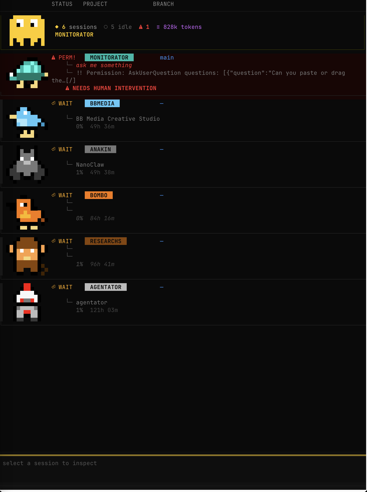

<div align="center">

```
 ███╗   ███╗ ██████╗ ███╗   ██╗██╗████████╗ ██████╗ ██████╗  █████╗ ████████╗ ██████╗ ██████╗
 ████╗ ████║██╔═══██╗████╗  ██║██║╚══██╔══╝██╔═══██╗██╔══██╗██╔══██╗╚══██╔══╝██╔═══██╗██╔══██╗
 ██╔████╔██║██║   ██║██╔██╗ ██║██║   ██║   ██║   ██║██████╔╝███████║   ██║   ██║   ██║██████╔╝
 ██║╚██╔╝██║██║   ██║██║╚██╗██║██║   ██║   ██║   ██║██╔══██╗██╔══██║   ██║   ██║   ██║██╔══██╗
 ██║ ╚═╝ ██║╚██████╔╝██║ ╚████║██║   ██║   ╚██████╔╝██║  ██║██║  ██║   ██║   ╚██████╔╝██║  ██║
 ╚═╝     ╚═╝ ╚═════╝ ╚═╝  ╚═══╝╚═╝   ╚═╝    ╚═════╝ ╚═╝  ╚═╝╚═╝  ╚═╝   ╚═╝    ╚═════╝ ╚═╝  ╚═╝
```

**Real-time TUI dashboard for all your [Claude Code](https://claude.ai/code) sessions**

[](https://www.python.org/downloads/)
[](LICENSE)
[](#development)
[](https://textual.textualize.io/)



---

</div>

## Features

- **8-bit sprite characters** — Each session gets a unique pixel-art character with idle/active/jump animations
- **Status bar indicators** — Green blinking bar (active), red blinking bar + "NEEDS HUMAN INTERVENTION" (permission), subtle bar (idle)
- **Pixel badge project names** — Retro game-style colored badges make project identity unmissable
- **Live session tracking** — See all running Claude Code sessions at a glance
- **CPU-based inference** — Detects active sessions even without hooks via process scanning
- **Anti-flicker** — CPU hysteresis + time-based status hold prevents status jitter
- **macOS notifications** — Get notified on permission requests, completions, and status changes
- **Detail panel** — Drill into any session for full context: tool in use, last prompt, branch, CPU, elapsed time
- **Chat history dropdown** — View conversation history inline per session
- **Hook + process fusion** — Combines hook events with live `ps`/`lsof` scanning for maximum accuracy
- **UUID-based matching** — Precise session-to-process linking, no ghost sessions

## Installation

### With uv (recommended)

```bash
git clone https://github.com/bebe-acme/monitorator.git
cd monitorator
uv sync
```

### With pip

```bash
git clone https://github.com/bebe-acme/monitorator.git
cd monitorator
pip install -e .
```

## Quick Start

**1. Install the Claude Code hooks:**

```bash
uv run monitorator install
```

This registers event hooks in `~/.claude/settings.json` that write session state to `~/.monitorator/sessions/`.

**2. Launch the dashboard:**

```bash
uv run monitorator
```

**3. Start using Claude Code normally.** Sessions appear automatically in the dashboard.

## CLI Commands

| Command                            | Description                                  |
| ---------------------------------- | -------------------------------------------- |
| `monitorator` or `monitorator run` | Launch the TUI dashboard                     |
| `monitorator status`               | Quick CLI status (no TUI)                    |
| `monitorator install`              | Install hooks into `~/.claude/settings.json` |
| `monitorator uninstall --clean`    | Remove hooks and clean session data          |

## How It Works

```
Claude Code hooks ──→ ~/.monitorator/sessions/*.json ──┐
                                                        ├──→ SessionMerger ──→ TUI
ps + lsof scanning ──→ ProcessInfo[] ──────────────────┘
```

1. **Hook** (`hooks/zig/`) — A compiled Zig binary that processes Claude Code events and writes session state as JSON. ~20x faster than the Python fallback (~2.7ms vs ~53ms per invocation). Falls back to `hooks/emit_event.py` (stdlib-only Python) if the binary is not available.

2. **ProcessScanner** — Finds running Claude Code processes via `ps`, resolves their working directory and session UUID via `lsof`.

3. **SessionMerger** — Joins hook data with process data by matching `cwd`. Applies CPU-based status override (idle → thinking if CPU > 10%) with hysteresis to prevent flicker.

4. **TUI** — Built with [Textual](https://textual.textualize.io/). Polls every 2s with diff-based updates. Each session gets a unique 8-bit sprite character, pixel badge project name, status bar indicator, and animated transitions.

## Architecture

```
src/monitorator/
├── cli.py              # Entry point & subcommands
├── models.py           # SessionState, ProcessInfo, MergedSession
├── scanner.py          # Process discovery (ps + lsof)
├── state_store.py      # Session JSON file I/O
├── merger.py           # Hook + process fusion, UUID matching, hysteresis
├── notifier.py         # macOS notifications
├── session_prompt.py   # Last user prompt from JSONL transcripts
├── context_size.py     # Context window estimation
├── labels.py           # User-defined session labels
├── tab_renamer.py      # Terminal tab renaming
├── terminal_opener.py  # Focus terminal window for a session
├── installer.py        # Hook installer/uninstaller
└── tui/
    ├── app.py          # Main Textual app (2s poll + 0.3s sprite animation)
    ├── session_row.py  # Per-session row: sprite + pixel badge + status bar
    ├── sprites.py      # 22 unique 8-bit characters with animations
    ├── detail_panel.py # Expanded session info panel
    ├── header_banner.py# Top banner with animated ghost eyes
    ├── chat_dropdown.py# Inline conversation history
    ├── column_header.py# Column labels
    ├── formatting.py   # Status icons, colors, activity text
    └── styles.tcss     # DexScreener-inspired dark theme
```

## Development

```bash
# Clone and install dev dependencies
git clone https://github.com/bebe-acme/monitorator.git
cd monitorator
uv sync --dev

# Run all tests
uv run pytest

# Run a single test file
uv run pytest tests/test_scanner.py

# Run a specific test
uv run pytest tests/test_merger.py -k "test_hysteresis"
```

### Requirements

- Python 3.11+
- macOS (process scanning uses `ps`/`lsof`; notifications use `osascript`)
- [uv](https://docs.astral.sh/uv/) for dependency management

### Hook Binary

A pre-built Zig binary is included at `hooks/zig/zig-out/bin/emit_event` for convenience.

> **Security note:** This binary was compiled on a contributor's machine. If you prefer not to trust pre-built binaries, build it yourself:
>
> ```bash
> # Requires Zig 0.15+ (https://ziglang.org/download/)
> cd hooks/zig
> zig build -Doptimize=ReleaseFast
> ```
>
> Then re-run `uv run monitorator install` to register the locally-built binary.

The installer automatically prefers the Zig binary and falls back to the Python script (`hooks/emit_event.py`) if it's not found.

### Key Conventions

- `from __future__ import annotations` in every module
- `hooks/emit_event.py` must remain stdlib-only (Python fallback)
- Tests use `pytest` with `pytest-asyncio`

## License

[MIT](LICENSE)
